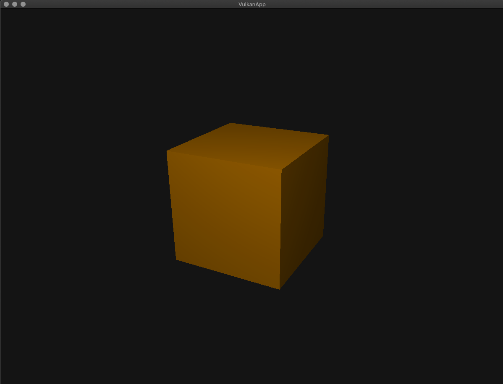

# My Vulkan Engine
My very own graphics engine where I test and learn the Vulkan API. This is the starting point of many vulkan projects.

### features implemented so far*

1) 3D & 2D geometry
2) Texture from files
3) UV Normal textures from files
4) Scene graph, allowing objects to become part of a parent objects, sharing on local coordinate
5) specular highlight (bling-phong lighting)
6) User input ArcBall
7) Scroll to zoom! makes use of perspective zoom rather than move the camera.
8) procedural subdivision
9) Various primitive shapes procedurally generated such as the cube, sphere and plane.

### DEFAULT CUBE!:

### Dependencies:
- glfw (window)
- Vulkan (graphics api)
- glm (math library)
- stb_image.h (for importing images: https://github.com/nothings/stb/blob/master/stb_image.h)

*This repo is kept simple as it serves a starting point for other vulkan projects. The features listed can be found in these repo.
